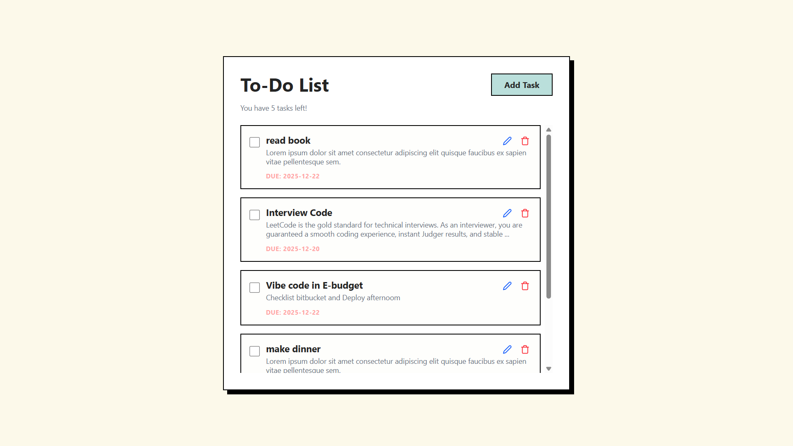

# 🖤 Neobrutalism To-Do List

> **A bold, high-contrast, and fully responsive Task Manager built with React & Tailwind CSS v4.** > _Clean Architecture. Atomic Design. Ready for Production._



## ✨ Key Features (ฟีเจอร์เด่น)

โปรเจกต์นี้ไม่ได้เป็นแค่ To-Do List ธรรมดา แต่มาพร้อมกับ **UI Kit** คุณภาพสูงและ **UX** ที่คิดมาอย่างดี:

-   **🎨 Neobrutalism Design:** ดีไซน์สไตล์ Brutalist สมัยใหม่ ขอบหนา เงาแข็ง สีสันจัดจ้าน
-   **🧩 Atomic UI Components:** แยก Component ชัดเจน (Button, Input, Card, Modal, Toast) นำไปใช้ต่อได้ทันที
-   **📱 Fully Responsive:** รองรับการใช้งานสมบูรณ์แบบทั้งบน Desktop, Tablet และ Mobile
-   **💾 LocalStorage Persist:** บันทึกข้อมูลอัตโนมัติ ข้อมูลไม่หายเมื่อรีเฟรชหน้า
-   **⚡ Smart Loading State:** จำลอง Loading Experience เหมือนแอปพลิเคชันจริง
-   **🔔 Interactive Feedbacks:** มีระบบ Toast Notification และ Confirm Dialog แจ้งเตือนทุกการกระทำ
-   **🛠️ Built with Tailwind CSS v4:** ใช้เทคโนโลยี CSS ล่าสุด ปรับแต่งง่ายผ่าน CSS Variables

## 🛠️ Tech Stack

-   **Framework:** [React](https://reactjs.org/) (Vite)
-   **Styling:** [Tailwind CSS v4](https://tailwindcss.com/)
-   **Icons:** [Lucide React](https://lucide.dev/)
-   **State Management:** Context API + useReducer
-   **Architecture:** Feature-based + UI Library folder structure

## Installation

### 1. Clone โปรเจกต์จาก GitHub

เปิด Terminal หรือ Command Prompt แล้วใช้คำสั่ง:

```bash
git clone https://github.com/phraewchuthamat/Todo-List-React.git
```

### 2. เข้าสู่โฟลเดอร์

```bash
cd Todo-List-React
```

### 3. ติดตั้ง dependencies

```bash
npm install
```

### 4. รันโปรเจ็ค

```bash
npm run dev
```

### 5. Open your browser at

```bash
http://localhost:5173
```
